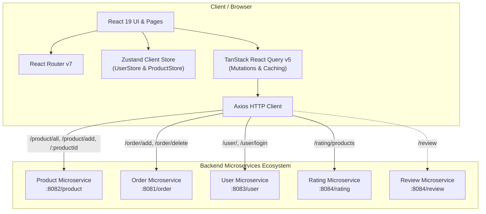

# Ashwga Frontend

[](https://react.dev/)
[](https://www.typescriptlang.org/)
[](https://vite.dev/)
[](https://tailwindcss.com/)
[](https://tanstack.com/query)
[](https://zustand-demo.pmnd.rs/)

> A modern, modular e-commerce client built with **React 19**, **Vite 7**, **TypeScript**, **Tailwind CSS v4**, **Zustand**, and **TanStack Query**. Designed specifically to interact seamlessly with a distributed backend microservices ecosystem.

---

## Table of Contents

- [Overview](#overview)
- [Key Features](#key-features)
- [System Architecture](#system-architecture)
- [Microservices Integration](#microservices-integration)
- [Technology Stack](#technology-stack)
- [Project Structure](#project-structure)
- [State Management & Data Flow](#state-management--data-flow)
- [Environment Configuration](#environment-configuration)
- [Getting Started](#getting-started)
  - [Prerequisites](#prerequisites)
  - [Installation](#installation)
  - [Running Locally](#running-locally)
  - [Building for Production](#building-for-production)
  - [Linting](#linting)
- [Pages and Routing](#pages-and-routing)
- [Components & UI Architecture](#components--ui-architecture)
- [API Reference & Query Hooks](#api-reference--query-hooks)
- [Roadmap & Future Enhancements](#roadmap--future-enhancements)

---

## Overview

**Ashwga Frontend** serves as the user-facing web application of the Ashwga e-commerce platform. It provides a clean, responsive shopping experience where users can discover products, view real-time ratings and reviews, add products to cart/orders, manage product catalogs, and authenticate their account.

The frontend is architected as an event-driven Single Page Application (SPA) that unifies multiple backend microservices (Product, Order, User, Rating, and Review) into a single cohesive interface.

---

## Key Features

- 🛍️ **Product Catalog & Grid**:
  - Dynamic multi-column responsive grid showcasing products with image rendering, pricing (₹ INR), star ratings, and review metrics.
  - Interactive hover actions allowing product removal/deletion with user confirmation.
  - Dedicated "Add Product" card embedded into the product grid for rapid catalog expansion.

- 🔍 **Detailed Product Page**:
  - High-resolution product image presentation with complete description and pricing.
  - Fractional star rating display (e.g. 4.5 ★) with total rating counts.
  - Interactive order quantity controller (`+` / `-` stepper) that creates or removes order items directly via the Order service.
  - Integrated "Other Products" carousel powered by Embla Carousel.

- ➕ **Product Creation (Admin / Vendor)**:
  - Form validation with controlled inputs for product name, price, available stock, and description.
  - Binary file upload handling: transmits `multipart/form-data` with an image file along with a JSON blob metadata payload.

- 🔐 **User Authentication**:
  - Dedicated Login (`/login`) and Sign-Up (`/signUp`) workflows.
  - Global user session state management via Zustand (`useUserStore`).
  - Dynamic navbar states showing login/signup buttons or active user status with single-click logout.

- ⚡ **Global Network & Feedback System**:
  - **Automated Loading Overlay**: Global backdrop-blur spinner powered by TanStack Query's `useIsFetching` and `useIsMutating`, displaying whenever network operations are in progress.
  - **Toast Notifications**: Reusable notifications powered by `react-toastify` for success confirmations, network failures, and authentication messages.

- 🧭 **Seamless Navigation**:
  - Sticky top navbar with search interface and brand navigation.
  - Automatic window scroll-to-top on route changes (`ScrollToTop`).
  - Centralized responsive layout wrapper (`Centerer`).

---

## System Architecture

Ashwga Frontend sits between the end-user and distributed backend microservices:



---

## Microservices Integration

The application routes requests to dedicated microservices defined in [src/constants/Microservices.ts](file:///d:/Umesh/Code/Ashwga-Frontend/src/constants/Microservices.ts). Each service endpoint is configurable via environment variables:

| Microservice | Default Local URL | Environment Variable | Key Endpoints Used |
| :--- | :--- | :--- | :--- |
| **Product Service** | `http://localhost:8082/product` | `VITE_SERVICE_PRODUCT` | `GET /all`<br>`GET /{productId}`<br>`POST /add`<br>`DELETE /delete/{productId}` |
| **Order Service** | `http://localhost:8081/order` | `VITE_SERVICE_ORDER` | `POST /add`<br>`DELETE /delete/{userId}/{productId}` |
| **User Service** | `http://localhost:8083/user` | `VITE_SERVICE_USER` | `POST /`<br>`POST /login` |
| **Rating Service** | `http://localhost:8084/rating` | `VITE_SERVICE_RATING` | `POST /products` |
| **Review Service** | `http://localhost:8084/review` | `VITE_SERVICE_REVIEW` | `GET /`, `POST /` |

---

## Technology Stack

| Category | Technology | Purpose |
| :--- | :--- | :--- |
| **Core Framework** | [React 19](https://react.dev/) | Component architecture, Virtual DOM, and hooks |
| **Build & Dev Tool** | [Vite 7](https://vite.dev/) | Blazing fast build tooling and Hot Module Replacement (HMR) |
| **Language** | [TypeScript 5.9](https://www.typescriptlang.org/) | Type safety, typed API requests/responses, and strict linting |
| **Styling** | [Tailwind CSS v4](https://tailwindcss.com/) + [tw-animate-css](https://www.npmjs.com/package/tw-animate-css) | Modern utility-first styling with Vite CSS pipeline |
| **Component Primitives** | [Radix UI Slot](https://www.radix-ui.com/) & [Shadcn UI](https://ui.shadcn.com/) | Accessible unstyled primitives (Button, Card, Carousel, Input) |
| **Routing** | [React Router v7](https://reactrouter.com/) | Client-side routing, route parameters, and layout outlets |
| **Server State** | [TanStack React Query v5](https://tanstack.com/query) | Asynchronous mutations, caching, and global network tracking |
| **Client State** | [Zustand v5](https://github.com/pmndrs/zustand) | Global state for authenticated user and cart item counter |
| **HTTP Client** | [Axios 1.x](https://axios-http.com/) | REST API requests and multipart form data submissions |
| **Carousel** | [Embla Carousel React 8](https://www.embla-carousel.com/) | Smooth touch/drag product slider |
| **Icons & Media** | [Lucide React](https://lucide.react.dev/) & [FontAwesome](https://fontawesome.com/) | UI icons (stars, trash, search, math controls) |
| **Notifications** | [React Toastify 11](https://fkhadra.github.io/react-toastify/) | Toast feedback popups |

---

## Project Structure

```
Ashwga-Frontend/
├── public/                     # Static assets (favicons, Vite logo)
├── src/
│   ├── assets/                 # React & project vector assets
│   ├── components/             # Reusable UI & business components
│   │   ├── AddProduct/         # AddProduct grid card trigger component
│   │   ├── Button/             # Customized Button wrapper
│   │   ├── Counter/            # Quantity stepper (+ / -) for orders
│   │   ├── Input/              # Standard text & file input component
│   │   ├── InputWithButton/    # Compound input + action button (Search)
│   │   ├── Navbar/             # Top sticky navbar with auth & search
│   │   ├── ProductCarousel/    # Embla-based horizontal product slider
│   │   ├── ProductDetailsComp/ # Product hero, price, details, and Buy CTA
│   │   ├── ProductList/        # Home grid mapping products + delete handler
│   │   ├── ShopCard/           # Product display card with rating & price
│   │   ├── Spinner/            # Spinner glyph & GlobalSpinner backdrop
│   │   ├── StarRating/         # Full & half star SVG rating generator
│   │   ├── Toast/              # ToastContainer config and showToast helper
│   │   ├── ui/                 # Shadcn base primitives (button, card, carousel, input)
│   │   └── index.ts            # Component barrel exporter
│   ├── constants/              # System constants (Microservice URLs)
│   ├── helpers/                # Helper utilities (e.g. getRatingsData)
│   ├── lib/                    # Shared utilities (cn for Tailwind merge)
│   ├── pages/                  # Page-level components & views
│   │   ├── AddProduct/         # Form page to upload new products
│   │   ├── Home/               # Main storefront product listing
│   │   ├── Login/              # User sign-in view
│   │   ├── ProductDetails/     # Full product view with carousel
│   │   ├── SignUp/             # User registration view
│   │   ├── layout.tsx          # Shell layout containing Navbar & Outlet
│   │   └── index.ts            # Pages barrel exporter
│   ├── routes/                 # Routing configuration
│   │   ├── Centerer.tsx        # Responsive content centering wrapper
│   │   ├── ScrollToTop.tsx     # Window scroll reset on route changes
│   │   └── index.tsx           # BrowserRouter route declarations
│   ├── services/               # Microservices API communication layer
│   │   ├── api/                # Raw Axios endpoints (product, order, rating, user)
│   │   └── queries/            # React Query mutation hooks
│   ├── store/                  # Zustand global stores
│   │   ├── useProductStore.ts  # Cart count stepper store
│   │   ├── useUserStore.ts     # User authentication state store
│   │   └── index.ts            # Store barrel exporter
│   ├── types/                  # TypeScript interfaces and data models
│   │   ├── Order.ts            # Order requests and delete payloads
│   │   ├── Product.ts          # Product schema and AddProductRequest
│   │   ├── Rating.ts           # Rating service request schemas
│   │   ├── User.ts             # User credential & signup models
│   │   └── index.ts            # Types barrel exporter
│   ├── App.css                 # Application-wide styling overrides
│   ├── App.tsx                 # Root component: QueryClientProvider & Router
│   ├── index.css               # Tailwind CSS v4 imports & theme directives
│   └── main.tsx                # React DOM entry point
├── components.json             # Shadcn UI configuration
├── eslint.config.js            # ESLint flat configuration (TypeScript & React)
├── index.html                  # HTML template with FontAwesome kit
├── package.json                # Project dependencies & run scripts
├── tsconfig.json               # TypeScript base & project references
├── tsconfig.app.json           # Application TypeScript configuration
├── tsconfig.node.json          # Node/Vite build TypeScript configuration
└── vite.config.ts              # Vite configuration (plugins & path aliases)
```

---

## State Management & Data Flow

### 1. Server State (TanStack React Query)
All network operations to the microservices are encapsulated within custom mutation hooks located in `src/services/queries/`:
- **`useGetAllProductsMutation`**: Loads the list of all products.
- **`useGetRatingOfProductsMutation`**: Takes an array of `productIds` and fetches rating aggregates.
- **`useGetProductByProductIdMutation`**: Fetches details for an individual product ID.
- **`useAddProductMutation`**: Sends a multipart form request to persist a new product.
- **`useDeleteProductMutation`**: Removes a product from the database.
- **`useOrderItemMutation` & `useDeleteOrderMutation`**: Adds or removes items from an order.
- **`useAddUserMutation` & `useLoginUserMutation`**: Manages registration and user sign-in.

### 2. Global Network Spinner
The application implements automated loading feedback in [GlobalSpinner.tsx](file:///d:/Umesh/Code/Ashwga-Frontend/src/components/Spinner/GlobalSpinner.tsx):
```tsx
const isFetching = useIsFetching();
const isMutating = useIsMutating();
const isLoading = isFetching + isMutating > 0;
```
Whenever any query or mutation is in flight across the entire app, `GlobalSpinner` activates an unobtrusive semi-transparent blurred backdrop and spinner without requiring manual loading flags on individual pages.

### 3. Client State (Zustand)
- **`useUserStore`**: Tracks current user details (`firstName`, `lastName`, `email`, `password`) upon login or registration. Provides `reset()` on logout.
- **`useProductStore`**: Tracks the selected item order counter (`count`, `increment`, `decrement`, `reset`), keeping the Buy button and Counter in sync.

### 4. Data Transformation (`getRatingsData`)
Because product data and product ratings are owned by separate microservices (`Product Service` on port 8082 and `Rating Service` on port 8084), the helper [getRatingsData.ts](file:///d:/Umesh/Code/Ashwga-Frontend/src/helpers/getRatingsData.ts) performs client-side merging:
1. Gathers all product IDs from the Product service response.
2. Dispatches a bulk query to the Rating service with `{ productIds: [...] }`.
3. Creates hash maps of `averageRating` and `ratingsCount` keyed by `productId`.
4. Merges rating properties directly onto each product object for uniform rendering in `ShopCard`.

---

## Environment Configuration

You can customize the microservice endpoints by creating a `.env` file in the root directory:

```env
# Microservices Base URLs
VITE_SERVICE_PRODUCT=http://localhost:8082/product
VITE_SERVICE_ORDER=http://localhost:8081/order
VITE_SERVICE_USER=http://localhost:8083/user
VITE_SERVICE_RATING=http://localhost:8084/rating
VITE_SERVICE_REVIEW=http://localhost:8084/review
```

If these environment variables are omitted, the application automatically falls back to the default `localhost` ports specified above.

---

## Getting Started

### Prerequisites

Ensure you have the following installed on your system:
- **Node.js**: `v18.0.0` or higher (Node.js 20+ LTS recommended)
- **npm** (or `pnpm` / `yarn`)
- Running instances of the Ashwga backend microservices (or mock servers) on the configured ports.

### Installation

Clone the repository and install dependencies:

```bash
git clone https://github.com/Umesh2202/Ashwga-Frontend.git
cd Ashwga-Frontend
npm install
```

### Running Locally

Start the Vite development server with Hot Module Replacement:

```bash
npm run dev
```

The application will typically be accessible at `http://localhost:5173`.

### Building for Production

To create an optimized production bundle:

```bash
npm run build
```

This compiles TypeScript using `tsc -b` and builds minified assets using Vite into the `dist/` directory.

To preview the production build locally:

```bash
npm run preview
```

### Linting

To inspect code for formatting and TypeScript/React linting rules:

```bash
npm run lint
```

---

## Pages and Routing

Routing is defined in [src/routes/index.tsx](file:///d:/Umesh/Code/Ashwga-Frontend/src/routes/index.tsx):

| Route Path | Page Component | Description |
| :--- | :--- | :--- |
| `/` | `Home` | Front store catalog showing all products in a grid with ratings and quick delete actions. |
| `/product/:productId` | `ProductDetails` | Detailed view for an individual product, rating breakdown, quantity counter / Buy CTA, and recommendation carousel. |
| `/product/add` | `AddProduct` | Vendor form to add a new product with file upload and price/inventory details. |
| `/login` | `Login` | Sign-in page validating user credentials against the User microservice. |
| `/signUp` | `SignUp` | Registration page creating new user profiles. |

---

## Components & UI Architecture

### Custom Components
- **`Navbar`**: Fixed/sticky top navigation bar with brand logo, search bar, and dynamic authentication actions (swapping between Login/Sign Up buttons and Logout based on `useUserStore`).
- **`ShopCard`**: Displays individual product card with base64 image, truncated title, star rating, price in INR, and a delete button with hover transition.
- **`ProductDetailsComp`**: Two-column layout showcasing large product imagery, descriptions, ratings badge, price, and dynamic switch between Buy CTA and Counter stepper.
- **`ProductCarousel`**: Drag/swipe-enabled product slider utilizing Embla Carousel.
- **`Counter`**: Stepper widget with `+` and `-` buttons that dispatches `orderItem` and `deleteOrder` mutations to the Order service.
- **`StarRating`**: Calculates whole stars, half stars (`StarHalf`), and empty stars based on float ratings.
- **`AddProduct` (Card)**: Card styled with a plus icon that navigates users directly to the `/product/add` form.
- **`GlobalSpinner` & `Spinner`**: Centered SVG animation and backdrop overlay connected to TanStack Query request state.
- **`Toast`**: Configured React-Toastify container providing animated notification alerts.

### Shadcn Primitives (`src/components/ui/`)
Built with Radix UI Slot and Class Variance Authority (CVA):
- `button.tsx`: Variant-driven button (`default`, `destructive`, `outline`, `secondary`, `ghost`, `link`) with size configurations.
- `card.tsx`: Structural cards (`Card`, `CardHeader`, `CardTitle`, `CardDescription`, `CardContent`, `CardFooter`).
- `carousel.tsx`: Embla carousel integration with Next/Previous trigger buttons.
- `input.tsx`: Accessible HTML input primitive.

---

## API Reference & Query Hooks

### Product Service (`/product`)
- `useGetAllProductsMutation()` -> `GET /all`
  - Fetches list of products.
- `useGetProductByProductIdMutation()` -> `GET /{productId}`
  - Fetches product details by ID.
- `useAddProductMutation()` -> `POST /add`
  - Payload: `FormData` with `imageFile` (File) and `product` (JSON Blob).
- `useDeleteProductMutation()` -> `DELETE /delete/{productId}`
  - Deletes product by ID.

### Order Service (`/order`)
- `useOrderItemMutation()` -> `POST /add`
  - Payload: `{ name: string, amount: number, userId: number, productId: string }`
- `useDeleteOrderMutation()` -> `DELETE /delete/{userId}/{productId}`
  - Payload: `{ userId: number, productId: number }`

### User Service (`/user`)
- `useAddUserMutation()` -> `POST /`
  - Payload: `{ firstName, lastName, email, password }`
- `useLoginUserMutation()` -> `POST /login`
  - Payload: `{ firstName, lastName, email, password }`

### Rating Service (`/rating`)
- `useGetRatingOfProductsMutation()` -> `POST /products`
  - Payload: `{ productIds: number[] }`
  - Response: Array of `{ productId, averageRating, ratingsCount }`

---

## Roadmap & Future Enhancements

- [ ] **Persistent Auth & JWT**: Store authentication tokens in `localStorage` / HTTP-only cookies to persist sessions across page reloads.
- [ ] **Search & Filtering**: Wire the search bar in `Navbar` to filter products by keyword, category, or price range.
- [ ] **Shopping Cart Page**: Dedicated shopping cart view aggregating order items with checkout flows.
- [ ] **Reviews Section**: Display individual text reviews and comments using the Review microservice (`/review`).
- [ ] **Image Storage Optimization**: Transition from base64 string storage to cloud object storage (e.g. AWS S3, Cloudinary) with CDN image URLs.
- [ ] **Form Validation**: Integrate `zod` and `react-hook-form` for form validation on product creation and user authentication forms.

---

## License

This project is licensed under the MIT License.
